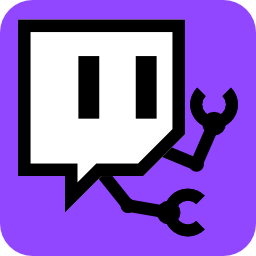
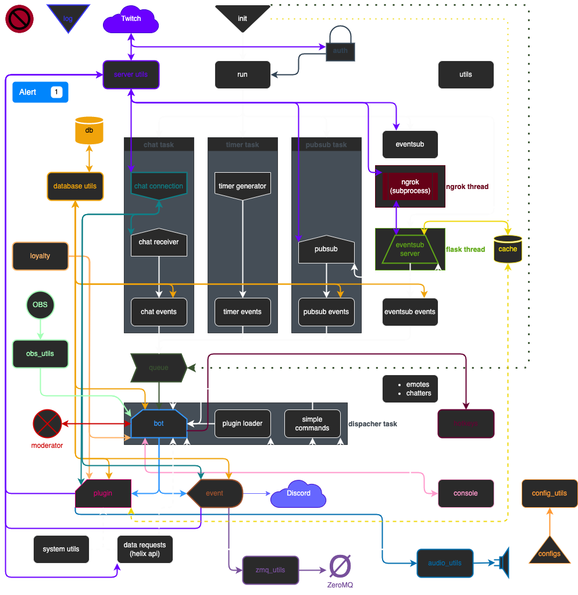

# Python Twitch Bot #

Plugin-based, asynchronous Python 3.9+ Twitch Bot with numerous integrations.

[](https://github.com/psf/black)
[](https://unlicense.org/)
[](https://github.com/PyCQA/bandit)


This was built more as a learning experience than because I thought anyone
would actually want to use this, but it's here now. This package is meant to
be used by anyone with a small degree of python knowledge as a lot is handled
automatically behind the scenes.

# Setup #
A few things are required to begin using the bot as detailed below.

## Python ##
This was built using Python 3.9 and will likely not work in earlier versions
due to changes with how asynchronous functions are handled.

## Basics ##
In the `configs/bot_config.yaml` file, you will need to fill two things:
1.  `username` should be the name of the bot's account.
2.  `owner` should be your channel name.
The rest of the config does not need to be changed unless you need to.

## Configs ##
There are several configs the contain the options for the bot that users can
change. Configs are cached the first time they are read and whenever they are
updated to prevent frequent disk reads.

## Authentication ##
This can be very confusing, and certainly was to me, so I'm going to document
the process here. If you intend to use this bot or write one of your own, you
will have to go through this same process. It's important to recognize that
there are essentially three types of tokens that serve different purposes.
-   **IRC OAuth**: Generated from
[Twitch TMI Wrapper](https://twitchapps.com/tmi/)
-   **OAuth**: This is generated for your application once the user allows you
to access private data.
-   **Bearer**: This is generated on the fly by the bot to access public
information.
-   **Access Token**: This is generated based on the **OAuth** token mentioned
above and allows you to authenticate the app.

### Prerequisits ###
1.  If you want the bot to be a seperate entity from yourself, you will need to
register a new account for the bot; otherwise just use your own. Be aware that
if you opt to use the same account, the bot's messages will show up as though
they were from you.
2.  You will need to log into Twitch's Developer Portal with the bot's account.
3.  Create a new project and from that you will get a `client_id` which you
will record into the `configs/secrets` file (although this value is
actually public).
1.  Generate a secret and record that secret in the `configs/secrets`
file.

**Note**: The secret, and all subsequent values used for authorization should,
as the name implies, be kept secret. In the event of these values becoming
public, regenerate the secret and any other tokens.

### Process ###
1.  You need to get authorization from the user (possibly yourself) to allow
the bot to access private information. To do this, you have to direct the user
to a web page with Twitch's authorization component. The URL to this page can
be generated by the Auth objects `generate_permissions_url` method.
2.  Once the user clicks either option, a new URL is generated and sent to
the `redirect_uri`. For personal use, `http://localhost` is fine. If the user
clicked Accept, the URL will have a `code` section.
3.  Take this code and record it as your OAuth token in
`configs/secrets`.
4.  Use this `code` to call the Auth's `get_access_token` method. This will
store a new `access_token` and a `refresh_token` in the `configs/secrets` file.

Official documentation is here:
[Getting Tokens: OAuth](https://dev.twitch.tv/docs/authentication/getting-tokens-oauth).

With these values all filled out, you should now be able to fully utilize
the bot.

# Running #
To run the bot, open a console to the root of this repo and run:
```bash
python run.py
```
There are a few arguments that can be used to modify usage:
-   `-c`, `--channel`: Set the channel to connect the bot to.
-   `--notimers`: Run the bot without timer events.
-   `--nopubsub`: Run the bot without PubSub events.
-   `--noeventsub`: Run the bot without EventSub events.
-   `--nochat`: Run the bot without connecting to chat.
-   `--noobs`: Run the bot without connecting to OBS.

# Moderator #
This bot comes with a Moderator that both filters malicious language, checks
plugins against cooldowns, and can set timeouts for users. This is meant to
suppliment what Twitch offers, not supplant them since that would actually be
impossible. Moderation is controlled by the `moderator/moderator` module as
well as a config for the module called `moderator_config`. There is likely not
much that needs to be changed here other than updating banned terms and
punishments for using them,

# Responses #
The bot can automatically respond to terms in chat as defined by the
`config/responses` file. Responses are based on either a term in the message
or a message as a whole. This is a quick alternative to plugins for simple
back-and-forths between the user and the bot.

# Plugins #
One of the biggest strengths of using a custom bot is the ability to utilize
the full power of Python to do whatever you want, and plugins is how you can
accomplish that. Each plugin is a stand-alone entity that is automatically
run based on the given parameters. Plugins can be run either based on a timer
or via a chat command.

# Database #
To store data long term, the bot utilizes a SQLite3 database stored in
`database/twitch_bot.db`. The first time the bot is run, the database is built
with a special `users` table to store user data. The bot will not overwrite an
existing database if one already exists, but will recreate it if missing.
Additionally, the database will be checked for tables for each plugin and
create them if non exist. The database should not require any direct
interaction.

# Cache #
A transient cache is available via the `cache` module for storing temporary
data while the bot is running. You can store any arbitrary data there, but
only as long as the bot is running. Once the bot has been shut down, all
data in the cache is lost. Data is stored like a dictionary with a key and
CacheData object which also offers a set lifespan for keeping the cache clean.

# API #
This functions as a wrapper around needed API calls. The Twitch API is
extensive and a lot of it was not needed by the bot, but more functionality can
easily be added as needed.

# PubSub #
This bot supports PubSub even though this seems to be an outdated system.
It might be removed in the future in favor of EventSub if EventSub has all
the same functionality. Almost all functions are confirmed redundant, so
EventSub handles almost everything.

# EventSub #
EventSub is handled via a Flask server that runs through a public URL generated
by [`ngrok`](https://ngrok.com/). By default, the `ngrok` executable should be
installed at: `~/ngrok/ngrok`. If using a free ngrok account, the callback URL
will be different every time the bot runs, so subscriptions are deleted and
created each time the bot is started up. If using a paid account or running
your own web server, it will only create missing subscriptions (subscriptions
in the config that are not registered with Twitch).

EventSub does not yet support websockets, so a seperate web server is needed
to receive events. Once websockets are available for use, the goal is to update
the bot to use it and remove the need for a web server.

# Queue #
Behind the scenes, the bot is based on a producer/consumer system in which
messages from Twitch are converted into events and placed into an event queue
for processing. The advantage of this is a consistant architecture for all
parts and the ability to run multiple concurent tasks that add to the same
queue. Internal events, such as timers, also go into the queue and anything
new added will go there as well. Events are run very similarly to plugins for
added consistency.

# Stats #
Once the stream ends, the bot can automatically generate stats for the stream.
Stats include the viewer count over time and numbers of subscriptions, bits,
raids, redemptions, and messages sent during the stream.

# Discord #
The ability to send a message to a defined Discord channel on stream start is
integrated as well as the ability to send an arbitrary message.

# ZeroMQ #
In order to facilitate communication between the bot and external programs,
ZeroMQ has been added. A publisher -> subscriber relationship exists between
the bot and any other programs so they only need to connect to the proper port.
The port can be found in the `zmq_utils.py` file alongside some example code.

**NOTE**: You may have to allow network connections from Python to use this.

# OBS Websockets #
OBS integration is available via the `obs_utils.py` library and `obs` folder.
To use this integration, OBS [OBS](https://obsproject.com/) and the
[`obs-websocket`](https://github.com/obsproject/obs-websocket)
extension needs to be installed. Both are open source projects with extensive
documentation. All available requests and events should be supported.

**NOTE**: You may have to allow network connections from Python to use this.

# Audio #
Basic audio playback is possible with the `audio_utils.py` library. Audio file
can be stored in the `audio` folder or another folder can be set in the config.
The [`playsound`](https://github.com/TaylorSMarks/playsound) library is used to
play the audio, so any formats supported by this are usable such as `mp3`.
While `pyobjc` is not required, it can be optionally installed to assist with
playing audio more efficiently.

# Command Console #
When the bot starts up, a web console will open up that allows for commands to
be sent through the bot. This includes chat, Discord, and ZMQ messages, as well
as reloading configs, plugins, and connecting and disconnecting to OBS. Options
including running the console on startup can be configured in the
`bot_config.yaml` config. Even if turned off, the console can be manually
accessed by going to the address and port in the config in a browser.

# Hotkeys #
The bot can trigger hotkeys on the system which are configured in the
`hotkeys.yaml` file. This is achieved via
[`pynput`](https://github.com/moses-palmer/pynput).

**NOTE**: If you are using MacOS, you may have to give Accessibility
permissions in order to use hotkeys.

**NOTE**: If Windows Defender flags this as a threat / keylogger
(`HackTool:SH/PythonKeylogger.B` or something similar), it is an erroneous
alert. **No inputs are recorded by the bot.** Please add an exception for the
file or the whole bot folder.

# Loyalty Points #
Users can accumulate loyalty points, a form of fictional currency by performing
certain actions such as watching the stream, following, subscribing, etc. The
events and point values can be configured in the `loyalty.yaml` file. Action
points are gained immediately and viewing points are accumulated every 10
minutes.

Points can be redeemed for rewards as also defined in the `loyalty.yaml` file.
Arbitrary points can be added or refunded if the action requested cannot be
performed or as a random reward.

# Desktop Notifications #
Cross-platform desktop notifications are available via the `notification.py`
module. By default, this is used to show that the bot has crashed, but this
behavior is configurable. Linux and macOS notifications are handled natively,
Windows is handled with [`winotify`](https://github.com/versa-syahptr/winotify)

# Excepthook #
A custom global `excepthook` exists in `exceptions/excepthook.py`. This can be
altered depending on how you want to handle `RuntimeError` exceptions.
By default, this prints a traceback and sends a desktop notification.

# Emotes #
On startup, the bot will query Twitch for available emotes and store them for
use. If you have BTTV and/or FFZ accounts, you can enable them in the
`bot_config` and those emotes will be queried as well.

# Project Stats #
There is a script in the `project_stats` folder that computes code statistics
for the bot including code count, cyclomatic complexity, maintainability, and
security. This helps keep the code clean, readable, and at least somewhat
secure.

# Diagram #


# Service Plan #
Currently, the bot is designed to do everything as a single, contained package.
If the bot was to move to a service deployed remotely, it would need to be
split into two components: a remote component and a local component. The local
component would handle hotkeys, audio, and any other processes that can only
be performed on the machine doing the streaming. The remote component would
handle everything else and relay information to the local component. At this
time, only one-way communication between the remote and local components is
necessary, and there is no plan on how to securely implement this.

# Pre-release #
Before releasing, please run the `prerelease.py` script which will do the
following:
-   Regenerate `pdoc` documentation
-   Regenerate `pygount` and `radon` bot stats
-   Run `black` linting

Any of these can be skipped using the arguments:
-   `skipdocs`: Run the pre-release script without generating docs.
-   `skipstats`: Run the pre-release script without generating stats.
    `skipblack`: Run the pre-release script without black linting.

# Notes #
